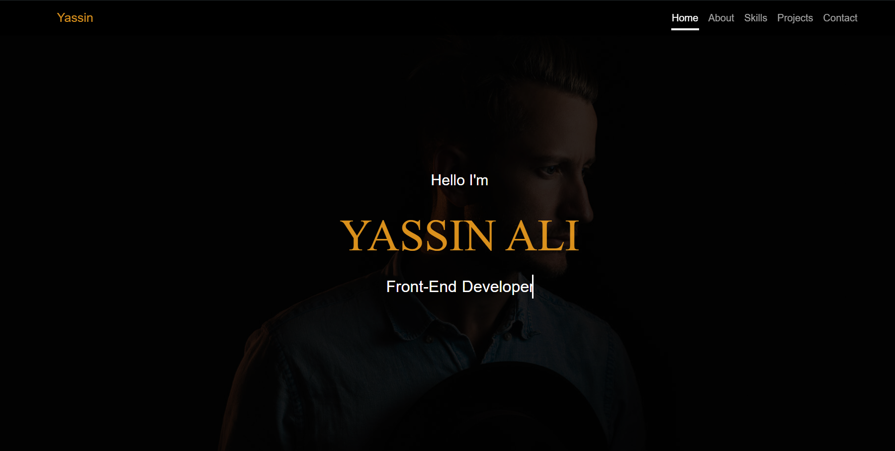

# Portfolio

## Description
This portfolio website showcases my skills, projects, and contact information. It is designed to be responsive and user-friendly, highlighting my work as a web developer.

## Features
- **Responsive Design**: The website is built using modern web technologies to ensure it looks great on all devices.
- **Skill Showcase**: A dedicated section to display my technical skills and competencies.
- **Project Gallery**: A collection of my best work with descriptions and images.
- **Contact Information**: Easy access to my contact details for potential clients or employers.

## Sections
- **Header**: The navigation bar and introductory information.
- **Home**: A welcome section with a brief introduction.
- **About**: Information about my background, experience, and interests.
- **Skills**: A detailed list of my technical skills.
- **Stats**: Visual representations of my accomplishments and statistics.
- **Projects**: A gallery of my projects with descriptions and links.
- **Contact**: A section with my contact information and a contact form.

## File Structure
- `index.html`: The main HTML file for the website.
- `images/`: This folder contains all the images used in the website.
- `styles/`: This folder contains:
  - `style.css`: The custom CSS file for additional styling.
  - `bootstrap.css`: The Bootstrap CSS file for responsive design.
  - `bootstrap.min.css`: The minified Bootstrap CSS file for optimized loading.

## How to Use
1. Open `index.html` in your web browser to view the portfolio website.
2. Navigate through the sections using the navigation bar or by scrolling.
3. Explore each section to learn more about my skills and projects.

## Live Demo
You can view the live demo of this project here: [Portfolio](https://yassenali.github.io/Portfolio2/)

## Acknowledgments
- Bootstrap for the responsive framework.
- All projects and images showcased are my own work.
- Special thanks to my mentors and peers for their support and feedback.
